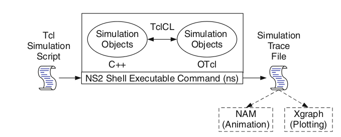

# Introduction to NS2

## Some of the key points of ns2 are as follows

- NS2 stands for Network Simulator Version.

- It is an open-source event-driven simulator designed specifically for research in computer communication networks.

## Features of the NS2

-  It is a discrete event simulator for networking research.

- It provides substantial support to simulate bunch of protocols like TCP, FTP, UDP, https and DSR.

- It simulates wired and wireless network.

- It is primarily Unix based.

- Uses TCL as its scripting language.

- Otcl: Object oriented support

- Tclcl: C++ and otcl linkage

- Discrete event scheduler

## Archtecture of NS2

NS2 Consists of two parts C++ and OTcl. C++ defines internal backend of the simulation objects. OTcl defines the assembling and configuring the objects as well as scheduling discrete events. The C++ and the OTcl are linked together using TclCL

Figure below shows the NS2 archtecture.

